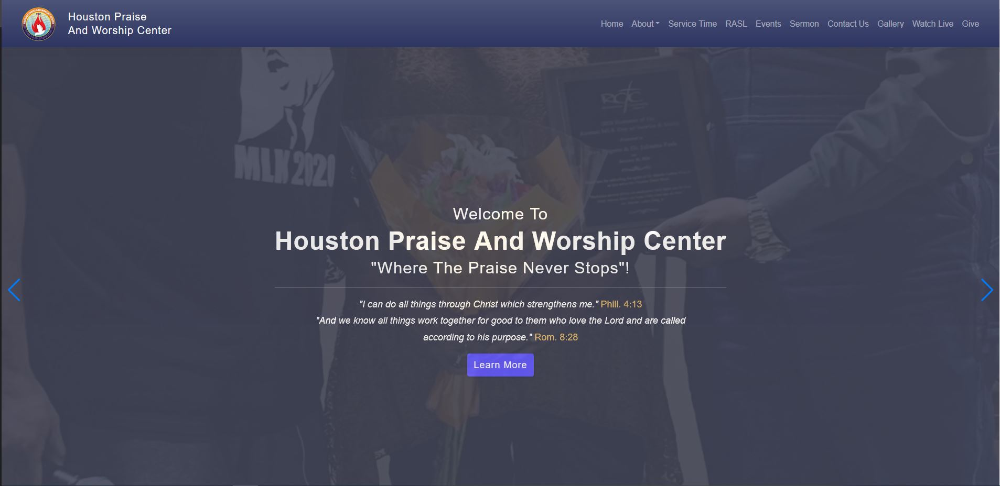
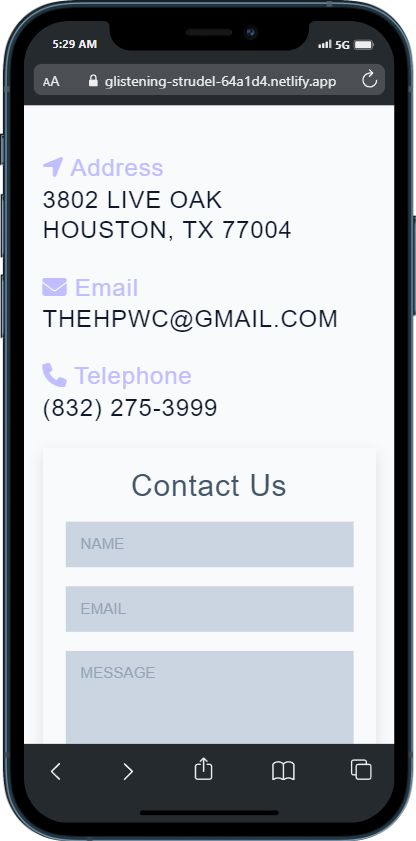

# Church Website

Welcome to the Church Website! Our goal is to provide a comprehensive and user-friendly platform for members and visitors to stay connected with the church community, access information about events, and learn about our beliefs and values.

## Features

- Homepage: A clear and concise introduction to the church, including our mission, vision, and values.
- Events: A calendar of upcoming events, including services, workshops, and social gatherings.
- About Us: Information about the history of the church, its leadership, and its beliefs.
- News and Blog: A platform for members to share news and updates, as well as blog posts on relevant topics.

## Demo



.jpeg>)

## Deployment

To deploy this project run

```bash
  Run locally by using live server
```

## Installation

Install my-project with npm

```bash
  npm install my-project
  cd my-project
```

## Contributing

We welcome contributions from members and visitors. If you would like to submit a blog post or news article, please send it to [adeyeriiyanu@gmail.com]. If you have any suggestions or feedback, please reach out to us at [adeyeriiyanu@gmail.com].

## Support

If you encounter any technical issues with the site, please contact [adeyeriiyanu@gmail.com]. Our team will be happy to assist you.

Thank you for visiting our Church Website! We hope you find it helpful and informative.
